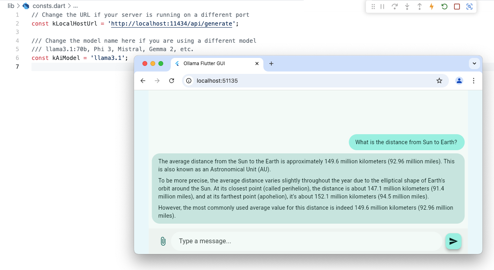

# Ollama Flutter GUI

[](https://github.com/gabrimatic/ollama_flutter_gui/actions/workflows/ci.yml)
[]()
[](https://flutter.dev)
[](https://ollama.com)
[](LICENSE)

Ollama Flutter GUI is a Flutter chat surface for local Ollama models. You run it against `localhost:11434`, load the models already pulled on your machine, and keep the chat path on your own Ollama runtime.

It is intentionally small: pick an endpoint, refresh local models, chat through Ollama's `/api/chat` endpoint, attach a small text file when the prompt needs context, and copy model output from the chat.

<p align="center">
  
</p>

## Local Runtime

Ollama Flutter GUI talks to your local Ollama server. It does not include a hosted model backend, account flow, telemetry path, or cloud fallback.

| Runtime path | Where it runs |
|--------------|---------------|
| Flutter UI | Browser |
| Model discovery | `GET /api/tags` on your Ollama endpoint |
| Chat | `POST /api/chat` with `stream: false` |
| File prompt context | In browser memory, then sent to your configured Ollama endpoint |
| Chat history | In app state for the current session |

## At a Glance

| Surface | Runtime scope | Status |
|---------|---------------|--------|
| Chat | Prompt a local Ollama model and keep prior turns in the request history. | Ready. |
| Model picker | Load models from `/api/tags` and switch between local tags. | Ready. |
| Endpoint control | Point the UI at another Ollama endpoint, then refresh models. | Ready. |
| File prompts | Attach one UTF-8 text file up to 1 MB and send it as prompt context. | Ready. |
| Web build | Build as a Flutter Web app. | Covered by CI. |

## Quick Start

Requirements: **Flutter stable**, **Dart 3.5+**, and **Ollama running locally**.

```bash
git clone https://github.com/gabrimatic/ollama_flutter_gui.git
cd ollama_flutter_gui
flutter pub get
flutter run -d chrome
```

Start Ollama and pull a model:

```bash
ollama pull llama3.1
ollama serve
```

Default endpoint: `http://localhost:11434`.

## Features

- **Local model discovery**: refreshes the model picker from Ollama's `/api/tags` endpoint.
- **Chat history**: sends previous turns to `/api/chat` so the model receives conversation context.
- **Endpoint switching**: edits the Ollama base URL from the app instead of changing source code.
- **File prompt context**: attaches one small text file and wraps it clearly in the prompt.
- **Connection feedback**: shows reachable, empty-model, request, and error states in the UI.
- **Copy output**: tap a message to copy it.
- **Flutter Web first**: the main path is `flutter run -d chrome` and `flutter build web --release`.

## Development

Run the normal checks:

```bash
flutter pub get
flutter analyze
flutter test
flutter build web --release
```

CI runs the same analyze, test, and web build path on pushes and pull requests.

## Project Structure

| Path | Purpose |
|------|---------|
| `lib/main.dart` | App bootstrap and theme |
| `lib/chat_screen.dart` | Chat UI, endpoint control, model picker, composer |
| `lib/chat_state.dart` | Riverpod state, file prompt handling, request flow |
| `lib/ollama_service.dart` | Ollama API client for `/api/tags` and `/api/chat` |
| `lib/chat_message.dart` | Message model and Markdown-rendered chat bubble |
| `test/chat_state_test.dart` | Local HTTP contract tests for model discovery, chat, and files |

## Configuration

Default values live in `lib/consts.dart`:

| Setting | Default | Notes |
|---------|---------|-------|
| `kDefaultOllamaBaseUrl` | `http://localhost:11434` | Change in the UI or source. |
| `kDefaultAiModel` | `llama3.1` | Used until `/api/tags` returns a local model. |
| `kMaxUploadBytes` | `1048576` | One MB per attached file. |

## Limits

- Streaming is not enabled yet; requests use `stream: false`.
- Files are sent as prompt text, not as binary uploads.
- Chat history is session-local and clears when the app reloads.
- Browser CORS still depends on how your Ollama server is exposed. If you serve the UI from a LAN or Tailscale address, allow that origin in Ollama before expecting browser requests to work.

## Links

[Ollama API](https://github.com/ollama/ollama/blob/main/docs/api.md) · [Flutter docs](https://docs.flutter.dev) · [Soroush](https://gabrimatic.info) · [GitHub](https://github.com/gabrimatic)

## License

MIT License. Details: [LICENSE](LICENSE).
